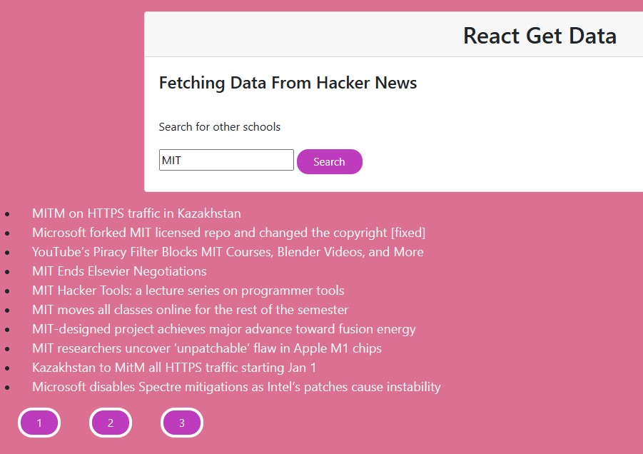

<a href="https://github.com/TennWilliams/Fetch-Data"> Fetch Data </a>
## Fetch-Data Exercise

In this exercise I fetch, manipulated, and rendered data from Hacker News.  I used the container form from boostrap to position the title, input box and search button in there to separate it from the search results.  I also changed the search button and page buttons to bootstrap buttons and added style to them.  I added color and hover effects to the links to make them stand out.

## Future Improvements
I want to obtain an API from other external source to fetch data from and chanage the look and features of the page to be tailored to this source.

To run this code you must clone this code on the command line and run it on a local server.

License through MIT
